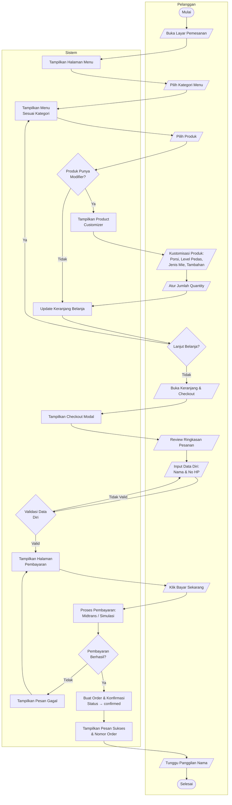
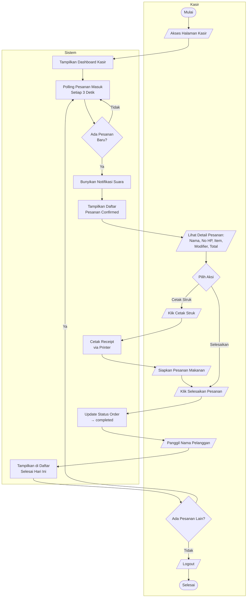
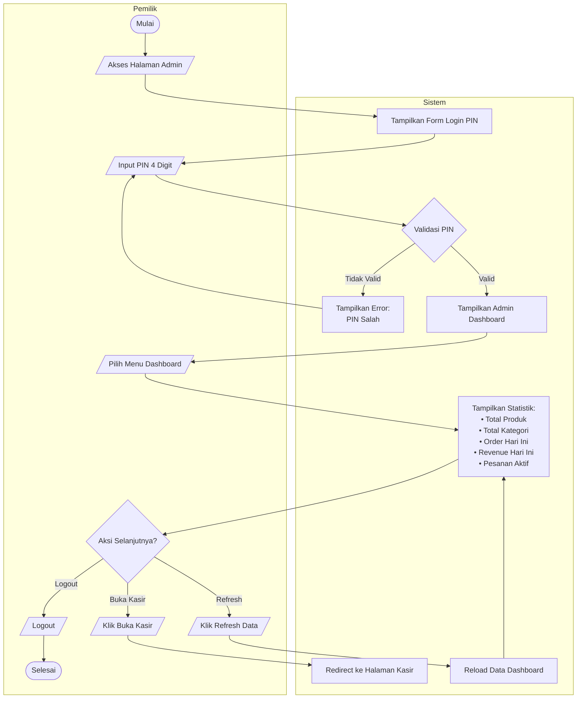
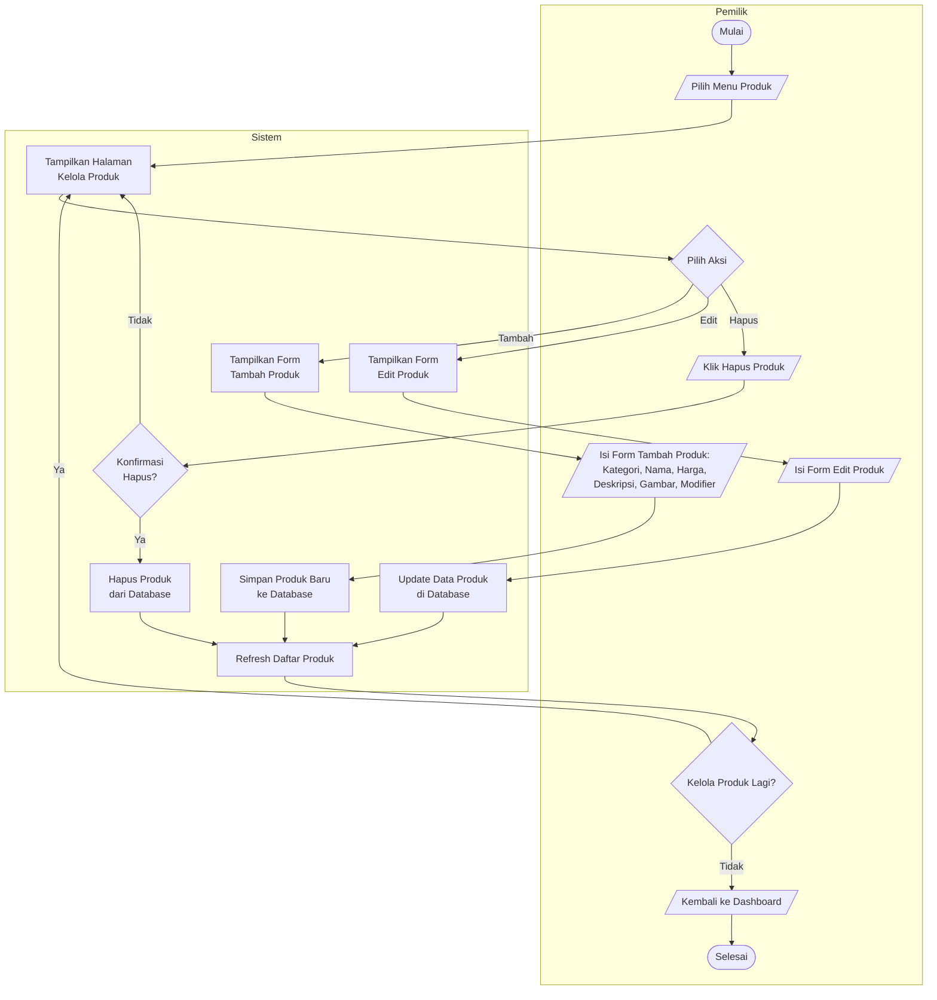
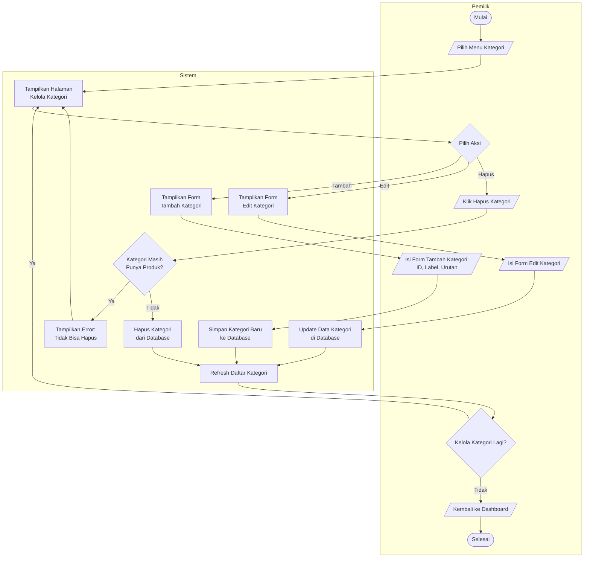
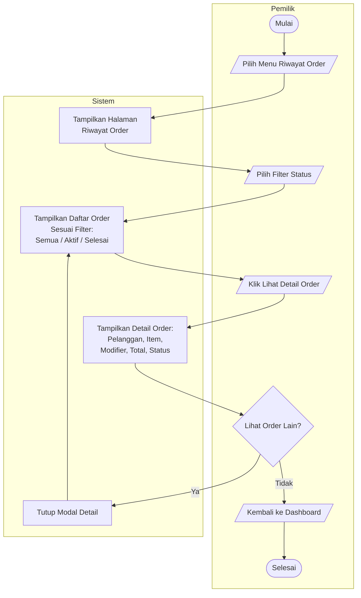
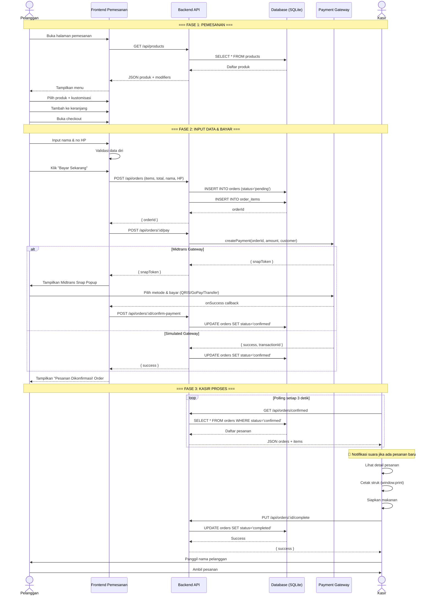
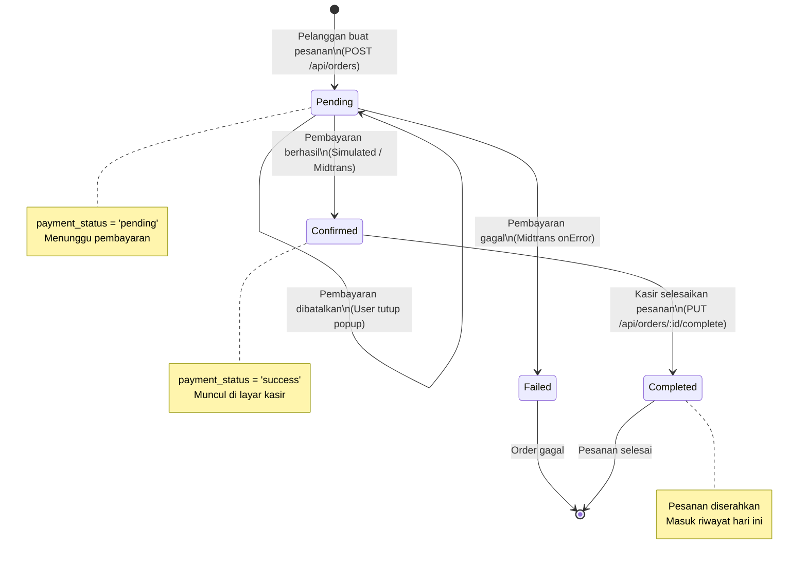

# Business Process — Sistem Pemesanan Mandiri Mie Nusantara

> Dokumen ini berisi analisis business process berdasarkan codebase project **kiosk-app-svelte**. Semua diagram menggunakan format **Mermaid** agar bisa langsung di-copy-paste.

---

## 1. Gambaran Umum Sistem

Aplikasi ini adalah **Sistem Pemesanan Mandiri** untuk restoran mie (Karsa Nusantara). Terdapat **3 aktor utama**:

| Aktor | Akses | Deskripsi |
|-------|-------|-----------|
| **Pelanggan** | Halaman utama (`/`) | Memesan makanan secara mandiri melalui layar pemesanan mandiri |
| **Kasir** | `/#/cashier` | Menerima pesanan masuk, cetak struk, dan menyelesaikan pesanan |
| **Pemilik (Admin)** | `/#/admin` (PIN: 1234) | Mengelola produk, kategori, melihat riwayat order, dan dashboard |

### Status Pesanan (Order Lifecycle)

| Status | Deskripsi |
|--------|-----------|
| `pending` | Pesanan dibuat, menunggu pembayaran |
| `confirmed` | Pembayaran berhasil, pesanan masuk ke kasir |
| `completed` | Pesanan sudah diserahkan ke pelanggan |

---

## 2. Use Case Diagram

```mermaid
graph TB
    subgraph Sistem Pemesanan Mandiri Mie Nusantara
        UC1["Lihat Menu & Kategori"]
        UC2["Kustomisasi Produk"]
        UC3["Kelola Keranjang"]
        UC4["Input Data Diri"]
        UC5["Bayar Pesanan"]
        UC6["Lihat Pesanan Masuk"]
        UC7["Cetak Struk"]
        UC8["Selesaikan Pesanan"]
        UC9["Login Admin via PIN"]
        UC10["Kelola Produk (CRUD)"]
        UC11["Kelola Kategori (CRUD)"]
        UC12["Lihat Dashboard & Statistik"]
        UC13["Lihat Riwayat Order"]
        UC14["Terima Notifikasi Pesanan Baru"]
    end

    Pelanggan((Pelanggan))
    Kasir((Kasir))
    Pemilik((Pemilik/Admin))

    Pelanggan --> UC1
    Pelanggan --> UC2
    Pelanggan --> UC3
    Pelanggan --> UC4
    Pelanggan --> UC5

    Kasir --> UC6
    Kasir --> UC7
    Kasir --> UC8
    Kasir --> UC14

    Pemilik --> UC9
    Pemilik --> UC10
    Pemilik --> UC11
    Pemilik --> UC12
    Pemilik --> UC13
```

---

## 3. Business Process — Pelanggan

### 3.1 Deskripsi Proses

1. Pelanggan melihat daftar menu yang ditampilkan di layar pemesanan mandiri
2. Pelanggan dapat memfilter menu berdasarkan kategori (Mie Kuah, Mie Goreng, Topping, Minuman, Cemilan)
3. Pelanggan memilih produk — jika produk memiliki **modifier** (pilihan porsi, level pedas, tambahan, dll.), maka muncul popup kustomisasi
4. Produk ditambahkan ke keranjang belanja
5. Pelanggan membuka **Checkout Modal** dan melakukan:
   - **Step 1**: Review ringkasan pesanan
   - **Step 2**: Input data diri (Nama Lengkap + Nomor HP) — wajib diisi
   - **Step 3**: Proses pembayaran (Midtrans / Simulasi)
   - **Step 4**: Konfirmasi sukses — pelanggan mendapat nomor order dan instruksi menunggu panggilan nama

### 3.2 Activity Diagram — Proses Pemesanan Pelanggan

---

## 4. Business Process — Kasir

### 4.1 Deskripsi Proses

1. Kasir mengakses halaman kasir (`/#/cashier`)
2. Sistem melakukan **polling** setiap 3 detik untuk mengambil pesanan dengan status `confirmed`
3. Ketika ada pesanan baru masuk, sistem membunyikan **notifikasi suara**
4. Kasir melihat daftar pesanan masuk beserta detail (nama pelanggan, nomor HP, daftar item, modifier, total harga)
5. Kasir dapat:
   - **Cetak Struk**: Mencetak receipt pesanan via printer
   - **Selesaikan Pesanan**: Mengubah status order menjadi `completed` setelah pesanan diserahkan ke pelanggan
6. Riwayat pesanan yang sudah selesai hari ini ditampilkan di sidebar

### 4.2 Activity Diagram — Proses Kerja Kasir

---

## 5. Business Process — Pemilik (Admin)

### 5.1 Deskripsi Proses

1. Pemilik mengakses halaman admin (`/#/admin`)
2. Harus login menggunakan **PIN 4 digit** (default: `1234`)
3. Setelah login, pemilik masuk ke **Admin Dashboard** dengan navigasi sidebar:
   - **Dashboard**: Melihat statistik (total produk, total kategori, order hari ini, revenue hari ini, pesanan aktif)
   - **Produk**: Mengelola produk (tambah, edit, hapus, termasuk pengaturan modifier/opsi kustomisasi)
   - **Kategori**: Mengelola kategori menu (tambah, edit, hapus — tidak bisa hapus jika masih ada produk)
   - **Riwayat Order**: Melihat semua pesanan dengan filter status (Semua, Aktif, Selesai) dan detail per order

### 5.2 Activity Diagram — Kelola Dashboard & Statistik

### 5.3 Activity Diagram — Kelola Produk

### 5.4 Activity Diagram — Kelola Kategori

### 5.5 Activity Diagram — Lihat Riwayat Order

---

## 6. Sequence Diagram — Alur Pemesanan Lengkap (Interaksi Antar Sistem)

---

## 7. State Diagram — Siklus Hidup Pesanan (Order)

---

## 8. Matriks RACI (Responsibility Assignment)

| Proses | Pelanggan | Kasir | Pemilik/Admin |
|--------|:---------:|:-----:|:-------------:|
| Lihat menu & kategori | **R** | — | — |
| Kustomisasi produk | **R** | — | — |
| Input data diri | **R** | — | — |
| Bayar pesanan | **R** | — | — |
| Terima pesanan masuk | — | **R** | **I** |
| Cetak struk | — | **R** | — |
| Selesaikan pesanan | **I** | **R** | — |
| Kelola produk (CRUD) | — | — | **R** |
| Kelola kategori (CRUD) | — | — | **R** |
| Lihat dashboard & statistik | — | — | **R** |
| Lihat riwayat order | — | **C** | **R** |
| Login admin | — | — | **R** |

> **R** = Responsible (Pelaksana), **A** = Accountable, **C** = Consulted, **I** = Informed

---

## 9. Ringkasan Teknologi yang Digunakan

| Komponen | Teknologi |
|----------|-----------|
| Frontend | Svelte + Vite |
| Backend | Express.js (Node.js) |
| Database | SQLite (better-sqlite3) |
| Payment Gateway | Midtrans Snap / Simulated |
| Styling | CSS Custom Properties (Dark Theme) |
| Icons | Lucide Svelte |
| Routing | Hash-based routing (`window.location.hash`) |

---

## 10. Catatan Penting

1. **Autentikasi Admin** menggunakan PIN hardcoded (`1234`) — belum ada sistem token/session yang persisten.
2. **Payment Gateway** mendukung dua mode: `simulated` (untuk development) dan `midtrans` (untuk production).
3. **Kasir** tidak memerlukan login — langsung akses via URL `/#/cashier`.
4. **Polling** digunakan kasir untuk refresh pesanan (interval 3 detik) — bukan WebSocket/real-time.
5. **Webhook Midtrans** tersedia di `POST /api/payment/webhook` tetapi tidak bisa digunakan di localhost (fallback ke frontend callback).
6. **Kategori** tidak bisa dihapus jika masih memiliki produk yang terkait.
